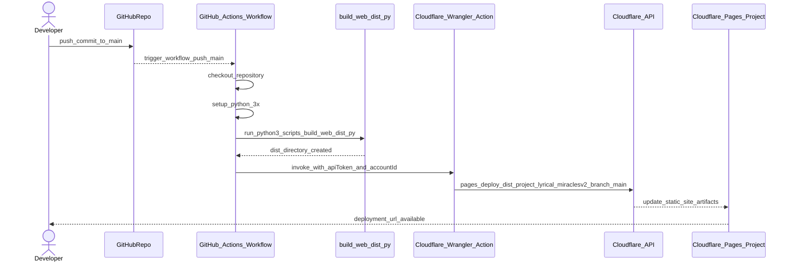

# Lyrical Miracles v2 — EverLight Archive Backbone

This folder is the cleaned, future-facing version of the `lyrical-miracles` repo. It aligns the Hawk Eye catalog with the infrastructure plan from *The Omniversal Aether* so we can:  
- ship a Git-ready archive,  
- mirror all assets into Cloudflare R2 + D1 (or Postgres), and  
- feed CMS targets (WordPress, Ghost, Drupal, Astro/Next.js) plus Workers AI / AutoRAG pipelines.

## Layout
```
lyrical-miracles-v2/
├─ content/
│  ├─ articles/          ← essays, SEO briefs, front matter
│  ├─ lyrics/            ← release folders with Markdown/HTML/IPYNB source
│  └─ notebooks/         ← creative + business notebooks (cleaned copies)
├─ media/
│  ├─ audio/raw/         ← lossless stems + masters (to sync with R2)
│  └─ images/raw/        ← cover art, promo assets, liner scans
├─ data/
│  ├─ catalogs/          ← CSV/JSON truth (music, merch, manifests)
│  └─ reference/         ← site maps, html exports, planning docs
├─ docs/                 ← operating guides (structure, pipelines, TODOs)
├─ platform/
│  ├─ exporters/         ← CMS + API push scripts (wordPress, Ghost, etc.)
│  ├─ infra/             ← IaC / Terraform / MAAS notes
│  └─ widgets/           ← client components (player, chat, embeds)
├─ scripts/              ← build + ingest automation
├─ dist/                 ← generated manifest + parquet exports
└─ media + data → future Cloudflare R2 bucket + D1/Postgres sync
```

## Quick Start
1. Drop or edit lyric markdown under `content/lyrics/releases/<release>/...`.  
2. Run `python scripts/normalize_assets.py` to enforce slug, metadata, and pointer consistency.  
3. Run `python scripts/build_manifest.py --out dist/manifest.json` to bundle lyrics, merch, media, and metadata into a single machine-readable document for CMS + AI ingestion.  
4. Upload binaries from `media/audio` + `media/images` to Cloudflare R2, saving the returned keys back into `dist/manifest.json`.  
5. Use `platform/exporters/*` to sync pages/posts into WordPress, Ghost, Drupal, or static builds.  
6. Trigger the Vectorize/AutoRAG ingest described in `docs/EverLights_autorag_guidebook.md`.

## Status
- Source materials imported from `~/lyrical-miracles/HAWK-ARS`.  
- TODO backlog copied into `docs/NEXTSTEPS_TODO.md`.  
- Scripts + docs are stubs—fill them out as we codify the pipeline.
---

<!-- Generated by sourcery-ai[bot]: start review_guide -->

## Reviewer's Guide

Switches static site deployment from GitHub Pages to Cloudflare Pages by introducing a new GitHub Actions workflow that builds the web dist via Python and deploys with Cloudflare Wrangler, while updating docs and removing the old Pages workflow.

#### Sequence diagram for CI deployment to Cloudflare Pages on push to main



### File-Level Changes

| Change | Details | Files |
| ------ | ------- | ----- |
| Introduce Cloudflare Pages deployment workflow using Wrangler and the existing Python dist build script. | <ul><li>Add a GitHub Actions workflow that triggers on pushes to main and on manual dispatch.</li><li>Set up Python 3.x in CI and run scripts/build_web_dist.py to generate the dist/ static site output.</li><li>Use cloudflare/wrangler-action@v3 with repo secrets for API token and account ID to run `pages deploy dist` against the lyrical-miraclesv2 project on the main branch.</li><li>Configure workflow permissions, concurrency group, and basic job structure for the deploy pipeline.</li></ul> | `.github/workflows/cloudflare-pages.yml` |
| Document Cloudflare Pages usage and required configuration for deployment. | <ul><li>Describe the tiny static browser for the lyrics archive and how to build and serve dist/ locally.</li><li>Explain that the new CI workflow publishes dist/ to Cloudflare Pages.</li><li>List required GitHub secrets (CLOUDFLARE_API_TOKEN, CLOUDFLARE_ACCOUNT_ID) and the expectation for the Pages project name, with a note that it can be changed in the workflow.</li></ul> | `README.md` |
| Remove legacy GitHub Pages deployment workflow. | <ul><li>Delete the previous GitHub Pages GitHub Actions workflow file so it no longer runs or conflicts with Cloudflare Pages deployment.</li></ul> | `.github/workflows/pages.yml` |

---

<details>
<summary>Tips and commands</summary>

#### Interacting with Sourcery

- **Trigger a new review:** Comment `@sourcery-ai review` on the pull request.
- **Continue discussions:** Reply directly to Sourcery's review comments.
- **Generate a GitHub issue from a review comment:** Ask Sourcery to create an
  issue from a review comment by replying to it. You can also reply to a
  review comment with `@sourcery-ai issue` to create an issue from it.
- **Generate a pull request title:** Write `@sourcery-ai` anywhere in the pull
  request title to generate a title at any time. You can also comment
  `@sourcery-ai title` on the pull request to (re-)generate the title at any time.
- **Generate a pull request summary:** Write `@sourcery-ai summary` anywhere in
  the pull request body to generate a PR summary at any time exactly where you
  want it. You can also comment `@sourcery-ai summary` on the pull request to
  (re-)generate the summary at any time.
- **Generate reviewer's guide:** Comment `@sourcery-ai guide` on the pull
  request to (re-)generate the reviewer's guide at any time.
- **Resolve all Sourcery comments:** Comment `@sourcery-ai resolve` on the
  pull request to resolve all Sourcery comments. Useful if you've already
  addressed all the comments and don't want to see them anymore.
- **Dismiss all Sourcery reviews:** Comment `@sourcery-ai dismiss` on the pull
  request to dismiss all existing Sourcery reviews. Especially useful if you
  want to start fresh with a new review - don't forget to comment
  `@sourcery-ai review` to trigger a new review!

#### Customizing Your Experience

Access your [dashboard](https://app.sourcery.ai) to:
- Enable or disable review features such as the Sourcery-generated pull request
  summary, the reviewer's guide, and others.
- Change the review language.
- Add, remove or edit custom review instructions.
- Adjust other review settings.

#### Getting Help

- [Contact our support team](mailto:support@sourcery.ai) for questions or feedback.
- Visit our [documentation](https://docs.sourcery.ai) for detailed guides and information.
- Keep in touch with the Sourcery team by following us on [X/Twitter](https://x.com/SourceryAI), [LinkedIn](https://www.linkedin.com/company/sourcery-ai/) or [GitHub](https://github.com/sourcery-ai).

</details>

<!-- Generated by sourcery-ai[bot]: end review_guide -->
